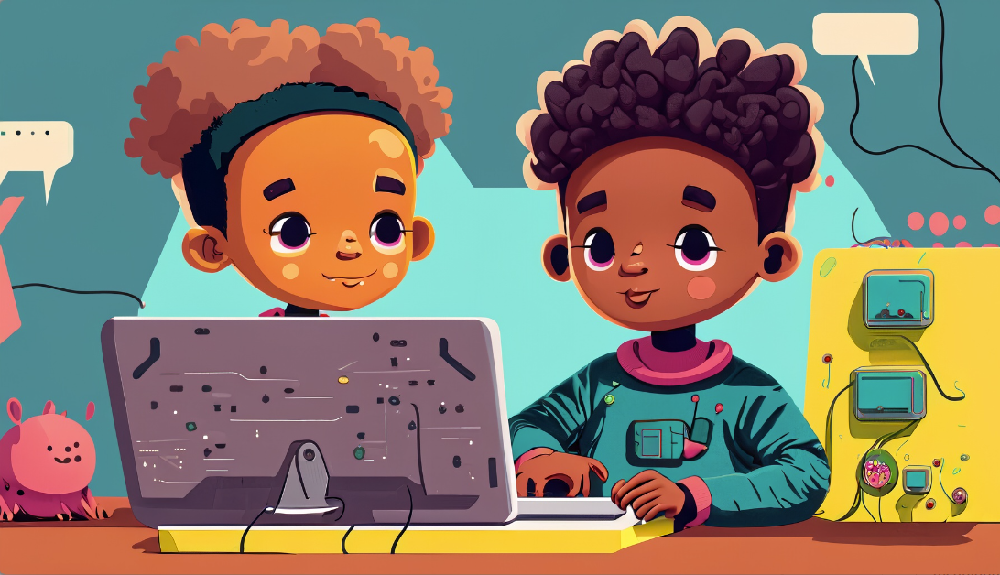

# Quest Achieved!

**Congratulations and much respect, young creator!** You've done it! You've successfully completed the challenging five-stage quest of creating an AI DJ in Scratch with Spotify and Machine Learning. You should be proud of yourself for persevering and working hard to achieve this impressive feat!

You've gained some** fantastic skills and knowledge** by completing this quest, and we encourage you to **keep exploring** the exciting world of Machine Learning and AI in your future creations. Keep experimenting and learning, and we have **no doubt** that you'll continue to create some **amazing, world changing things**!

We **can't wait** to see what you'll come up with next time for the Experience AI Challenge! There will be even more exciting quests to achieve, and we know that you'll be up for the adventure. 

So, take some time to celebrate your accomplishments and get ready for what's next. You're all **rockstars**, and we can't wait to see where your creativity and ingenuity take you!

